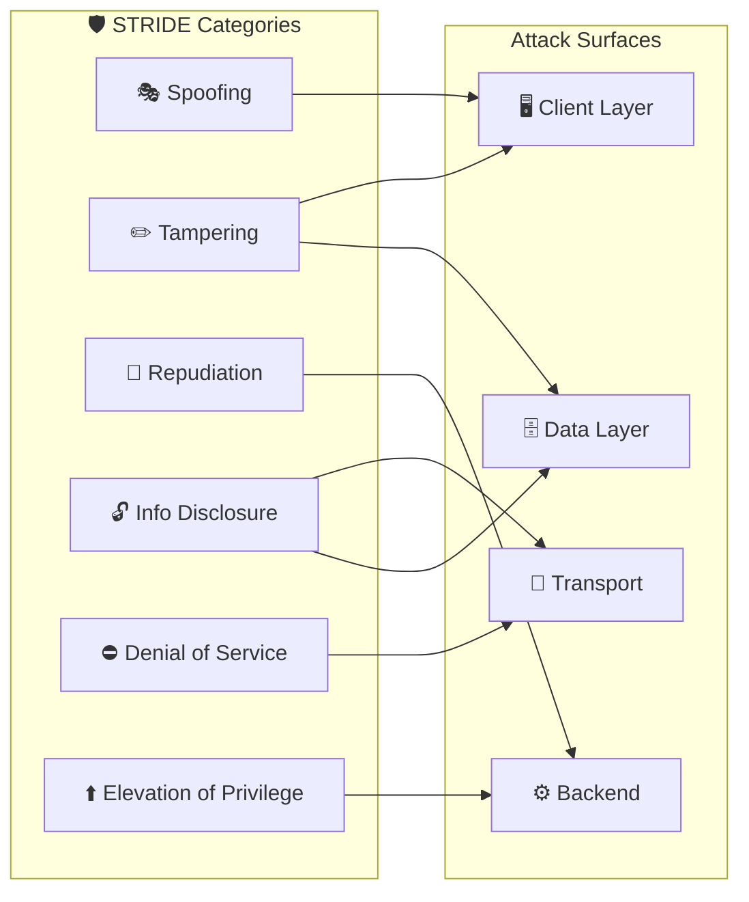
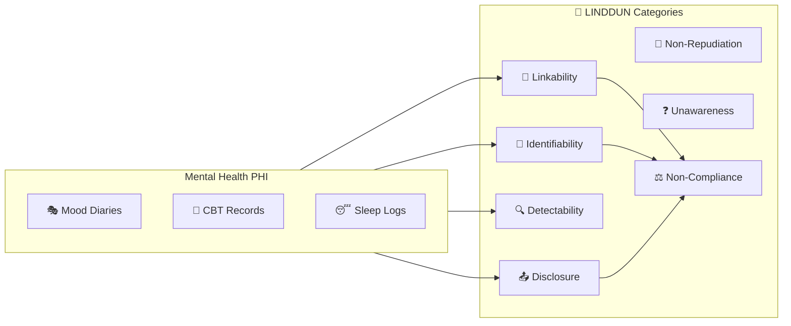

# OP_Client-Companion-Governance

> Centralized governance, reusable workflows, and compliance standards for Clinical/Personal Therapy Companion projects.

[](https://github.com/mgmacri/OP_Client-Companion-Governance/actions/workflows/ci.yml)
[](LICENSE.md)

---

## �️ Threat Modeling

This project implements comprehensive threat modeling using industry-standard frameworks to protect sensitive mental health PHI.

### STRIDE Security Threat Model

The [STRIDE threat model](docs/stride-threat-model.mmd) identifies security threats across all system layers:



| Threat Category | Key Mitigations | Compliance Gates |
|-----------------|-----------------|------------------|
| **Spoofing** | MFA, JWT validation, App attestation, Credential verification | G16 |
| **Tampering** | AES-256-GCM encryption, Schema validation, Immutable audit logs | G6, G15 |
| **Repudiation** | Signed entries, Actor identification, Tamper-evident logging | G15 |
| **Information Disclosure** | TLS 1.3, Encryption at rest, PHI scrubbing in logs | G4, G6 |
| **Denial of Service** | Rate limiting, Queue depth limits, Exponential backoff | G6 |
| **Elevation of Privilege** | RBAC, Row-level security, Least privilege principle | G4 |

📄 **[View Full STRIDE Diagram](https://mermaid.live/edit#pako:eNp9VE1v2zAM_SuCTi2QBHa-nAPWYoduKHbo6aKLLNGJGlnyJDptUOS_j7KTpkkP9UHie-QjKfLIpLOIErJ2Zuc0EqqQ3FXZOJeYoF-YGv6e7UlmkVQJr_Hl--Pj0-M8O_t-e7v4fLNY_Hi4X87m57Mvt7PbxYfb-_nl_PbTxex2_vn-YXk9n11-eHg-u7p7vrxeXN7dXf6FMwX2hMRs2MBh_i77RdLWkVx5hBIlHQSa5zUaHwTXuqZbQU8U3qkVeXJN_Rnqq0_7nNR7fHlxcXF-_u16cXY--3yxvJ7PL67uvt4sFvPZ7P58fnN1s7y-uL38dHX3cP9xvry4vL--urq5vry-uf_25ery5u7h4-Xt1c3Dw_X97d317fLu-urz59X1xcPN_eXN8-L68_LzZHZ9s7y7X07O5zdXy-Vy-fD9-uZ--fnq5uvt5d23m8u7i4u7u8vr24fry_v7q9u7y7u728X1_eJ--enu7vLm4X5xdXt1u1zcXd8tb-8uvt5c3VxdX999Xd5d_pq8u7m7v71f3ixvLm6_3t3fXd3fLS8urm4u7y9uvt7dP/)**

---

### LINDDUN Privacy Threat Model

The [LINDDUN privacy threat model](docs/linddun-privacy-threat-model.mmd) addresses privacy-specific threats for PHI:



| Privacy Threat | Risk Level | Key Mitigations | Provincial Acts |
|----------------|------------|-----------------|-----------------|
| **Linkability** | HIGH | Purpose limitation, Separate access controls | PHIPA s.30, HIA s.27 |
| **Identifiability** | CRITICAL | Pseudonymization, k-anonymity, UUID keys | G11, PIPEDA Sch.1 |
| **Non-Repudiation** | MEDIUM | Consent explains permanence, Correction rights | G5, G8 |
| **Detectability** | HIGH | Traffic padding, Generic endpoints, E2E encryption | G6 |
| **Disclosure** | CRITICAL | Encryption at rest, Need-to-know access, DPAs | G4, G6, G9 |
| **Unawareness** | HIGH | Clear privacy notices, Complete data inventory | G1, G2, G3 |
| **Non-Compliance** | CRITICAL | Compliance gates G1-G17, Legal review, Audits | All Canadian PHI Acts |

📄 **[View Full LINDDUN Diagram](https://mermaid.live/edit#pako:eNqFVMtu2zAQ_BWCJ7dI7Dh-5OAiTVEgKFL0kIOgi0SuJTYUqZKUExfBv3epR-I4yUEHcnZmd7jLfRLOGMSJCHqdaBYVEq0IXR77hDT4Z3jb_I6PEFooqEAXr_H14eF-_il-9_7d6vPn1erz6svNchV_iO_vl7frj6vV-tPd3e3d-sPq7m69Wn9YfVrdf7y7u71bfVp9WN2v_8CagGMQM2kD-_mL9JeoK-Nk6AGSVPQQpB7naEIQuug1WolyRvFJLCmQK-5_onnyzJ-9vo9Pzy8uz88vVqvz8_j97f3qdr1er29Xq_u71erL-u7-drVa36xW6_u7u_V6tbq_v127X8X3q/)**

---

## �📋 Overview

This repository provides **organization-wide governance** for clinical and mental health software development. It follows the [Microsoft ISE Centralized Governance Model](https://github.com/microsoft/code-with-engineering-playbook) and enforces security-first, compliance-ready CI/CD practices.

### Key Principles

- **🔒 Security First** - All workflows use SHA-pinned actions and OIDC authentication
- **✅ Compliance Ready** - Built for HIPAA, GDPR, and clinical audit requirements
- **🔄 Reusable** - Thin wrappers in app repos call centralized workflows
- **🤖 AI-Assisted** - Agent specifications for Copilot-powered code review and planning
- **📊 Auditable** - Full traceability from issue to deployment

---

## 📁 Repository Structure

```plaintext
OP_Client-Companion-Governance/
├── .github/
│   ├── actions/                    # Reusable composite actions
│   │   ├── security-scan/          # Security scanning (secrets, SAST, deps)
│   │   │   ├── action.yml
│   │   │   └── README.md
│   │   └── setup-node-pnpm/        # Node.js + pnpm environment setup
│   │       ├── action.yml
│   │       └── README.md
│   └── workflows/                  # Reusable workflow_call workflows
│       ├── ci.yml                  # Continuous integration
│       ├── pr-check.yml            # Pull request validation
│       ├── release.yml             # Secure release pipeline
│       └── schedule.yml            # Scheduled maintenance
├── docs/
│   ├── stride-threat-model.mmd    # 🛡️ STRIDE security threat model
│   ├── linddun-privacy-threat-model.mmd  # 🔐 LINDDUN privacy threat model
│   ├── architecture-diagram.mmd    # System architecture diagram
│   ├── data-flow-diagram.mmd       # PHI data flow diagram
│   ├── agents/                     # AI agent specifications
│   │   ├── backend.agent.md
│   │   ├── compliance-tagger.agent.md
│   │   ├── devops.agent.md
│   │   ├── frontend.agent.md
│   │   ├── mobile.agent.md
│   │   ├── planner.agent.md
│   │   ├── qa-compliance.agent.md
│   │   ├── quality-senior-reviewer.agent.md
│   │   ├── release-manager.agent.md
│   │   ├── sdet.agent.md
│   │   └── workflow-audit.agent.md
│   ├── prompts/                    # Reusable prompt templates
│   │   ├── review-architecture.prompt.md
│   │   ├── review-pr-scope.prompt.md
│   │   ├── review-pr.prompt.md
│   │   └── triage-backlog.prompt.md
│   ├── skills/                     # Copilot skill definitions
│   │   ├── ci-quality-gates/
│   │   ├── devops-generate-ci-workflow/
│   │   ├── github-actions-hardening/
│   │   ├── review-guardrails/
│   │   ├── review-pr-scope/
│   │   ├── test-determinism/
│   │   └── timestamps-utc/
│   ├── standards/                  # Compliance documentation
│   │   ├── Agent-Roles-Models.MD
│   │   ├── compliance-legislation.md
│   │   └── DevSecOps-Industry-Standards.md
│   └── templates/                  # Repository templates
│       ├── copilot-instructions.md
│       └── pull-request-template.md
├── scripts/                        # Governance automation scripts
│   ├── Generate-Project-App.ps1
│   └── Generate-Project-Governance.ps1
├── README.md
└── REPO_GOVERNANCE.md
```

---

## 🚀 Quick Start

### 1. Call Reusable Workflows from Your App Repo

For a step-by-step walkthrough, see [docs/INTEGRATION-GUIDE.md](docs/INTEGRATION-GUIDE.md).

Create thin wrapper workflows in your app repository:

**`.github/workflows/pr-check.yml`**
```yaml
name: PR Check

on:
  pull_request:
    branches: [main, develop]

jobs:
  pr-check:
    uses: mgmacri/OP_Client-Companion-Governance/.github/workflows/pr-check.yml@main
    with:
      node-version: "20"
      working-directory: "app/client-companion"
      run-security-scan: true
    permissions:
      contents: read
      pull-requests: read
      security-events: write
```

**`.github/workflows/release.yml`**
```yaml
name: Release

on:
  push:
    tags:
      - 'v*'

jobs:
  release:
    uses: mgmacri/OP_Client-Companion-Governance/.github/workflows/release.yml@main
    with:
      environment: production
      node-version: "20"
      working-directory: "app/client-companion"
    permissions:
      id-token: write
      contents: write
      packages: write
      attestations: write
```

**`.github/workflows/maintenance.yml`**
```yaml
name: Scheduled Maintenance

on:
  schedule:
    - cron: '0 6 * * 1'  # Weekly Monday 6am UTC
  workflow_dispatch:

jobs:
  maintenance:
    uses: mgmacri/OP_Client-Companion-Governance/.github/workflows/schedule.yml@main
    with:
      run-dependency-audit: true
      run-stale-cleanup: true
      run-license-check: true
    permissions:
      contents: read
      issues: write
      pull-requests: write
      security-events: write
```

---

## 📦 Reusable Workflows

### PR Check (`pr-check.yml`)

Validates pull requests before merge with lint, test, security, and compliance checks.

| Input | Type | Default | Description |
|-------|------|---------|-------------|
| `node-version` | string | `"20"` | Node.js version |
| `pnpm-version` | string | `"9"` | pnpm version |
| `working-directory` | string | `"."` | App working directory |
| `run-security-scan` | boolean | `true` | Enable security scanning |
| `fail-on-compliance-violation` | boolean | `true` | Fail on compliance issues |

### Release (`release.yml`)

Secure release pipeline with SLSA attestation and OIDC authentication.

| Input | Type | Default | Description |
|-------|------|---------|-------------|
| `environment` | string | **required** | Deployment environment |
| `node-version` | string | `"20"` | Node.js version |
| `working-directory` | string | `"."` | App working directory |
| `dry-run` | boolean | `false` | Perform dry run |
| `create-github-release` | boolean | `true` | Create GitHub release |

| Output | Description |
|--------|-------------|
| `version` | Released version number |
| `release-url` | URL to GitHub release |

### Schedule (`schedule.yml`)

Automated maintenance including dependency audits and stale cleanup.

| Input | Type | Default | Description |
|-------|------|---------|-------------|
| `run-dependency-audit` | boolean | `true` | Run vulnerability audit |
| `run-stale-cleanup` | boolean | `true` | Close stale issues/PRs |
| `run-license-check` | boolean | `true` | Validate licenses |
| `stale-days-before-stale` | number | `60` | Days before marking stale |
| `stale-days-before-close` | number | `14` | Days before closing |

---

## 🔒 Security Best Practices

### OIDC Authentication

All workflows use OIDC (OpenID Connect) for cloud authentication—no static secrets required.

```yaml
permissions:
  id-token: write  # Required for OIDC
  contents: read

jobs:
  deploy:
    runs-on: ubuntu-latest
    steps:
      - name: Configure AWS Credentials (OIDC)
        uses: aws-actions/configure-aws-credentials@e3dd6a429d7300a6a4c196c26e071d42e0343502 # v4.0.2
        with:
          role-to-assume: arn:aws:iam::123456789012:role/GitHubActionsRole
          aws-region: us-east-1
```

### SHA-Pinned Actions

All actions MUST be pinned by SHA, not version tag:

```yaml
# ✅ Correct - SHA pinned with version comment
uses: actions/checkout@11bd71901bbe5b1630ceea73d27597364c9af683 # v4.2.2

# ❌ Wrong - Version tag only
uses: actions/checkout@v4
```

### Branch Protection Rules

Configure these rules on `main` branch:

| Rule | Setting |
|------|---------|
| Require pull request reviews | ✅ 1 approval minimum |
| Dismiss stale PR approvals | ✅ Enabled |
| Require status checks | ✅ `lint`, `test`, `compliance` |
| Require branches to be up to date | ✅ Enabled |
| Require linear history | ✅ No merge commits |
| Include administrators | ✅ Rules apply to admins |
| Restrict force pushes | ✅ Disabled |
| Restrict deletions | ✅ Disabled |

---

## 🤖 AI Agents

### Agent Coverage Matrix

| Agent | Responsibility | Model |
|-------|---------------|-------|
| `planner` | Sprint planning, work package creation | GPT-5.2 |
| `backend` | Backend API development | GPT-5.2-Codex |
| `frontend` | React/Redux development | GPT-5.2-Codex |
| `mobile` | React Native development | GPT-5.2-Codex |
| `devops` | CI/CD workflow authoring | GPT-5.2-Codex |
| `sdet` | Test generation and coverage | Claude Sonnet 4.5 |
| `qa-compliance` | Compliance testing | Claude Opus 4.5 |
| `quality-senior-reviewer` | Code review | Claude Opus 4.5 |
| `workflow-audit` | Workflow security review | Claude Opus 4.5 |
| `compliance-tagger` | Label enforcement | Claude Sonnet 4.5 |
| `release-manager` | Release orchestration | GPT-5.2-Codex |

### Using Agents

Reference agents in your Copilot instructions:

```markdown
@workspace Use the qa-compliance agent to review this PR for HIPAA violations.

@workspace Apply the workflow-audit checklist to .github/workflows/release.yml
```

---

## 📊 Compliance

### Supported Frameworks

- **HIPAA** - Protected Health Information handling
- **GDPR** - EU data protection requirements
- **SOC 2** - Security controls
- **SLSA** - Supply chain security

### Audit Trail Requirements

All actions are logged with:

- UTC timestamps
- Actor identification
- Workflow run ID
- Commit SHA
- Environment

---

## 🛠️ Development

### Adding a New Workflow

1. Create workflow in `.github/workflows/`
2. Use `workflow_call` trigger with documented inputs
3. Pin all actions by SHA
4. Add explicit `permissions` block
5. Update this README
6. Have `workflow-audit` agent review

### Adding a New Agent

1. Create agent spec in `docs/agents/`
2. Follow the chatagent markdown format
3. Define required skills
4. Document input/output formats
5. Add to agent coverage matrix

---

## 📝 License

MIT License - See [LICENSE.md](LICENSE.md) for details.

---

## 🔗 Related Resources

- [GitHub Actions Security Hardening](https://docs.github.com/en/actions/security-guides/security-hardening-for-github-actions)
- [Microsoft Code With Engineering Playbook](https://microsoft.github.io/code-with-engineering-playbook/)
- [SLSA Framework](https://slsa.dev/)
- [OpenSSF Scorecard](https://securityscorecards.dev/)

### Threat Modeling Resources

- [Microsoft STRIDE Model](https://docs.microsoft.com/en-us/azure/security/develop/threat-modeling-tool-threats)
- [LINDDUN Privacy Threat Modeling](https://linddun.org/)
- [Mermaid Live Editor](https://mermaid.live/) - View and edit the threat model diagrams
- [OWASP Threat Modeling](https://owasp.org/www-community/Threat_Modeling)

